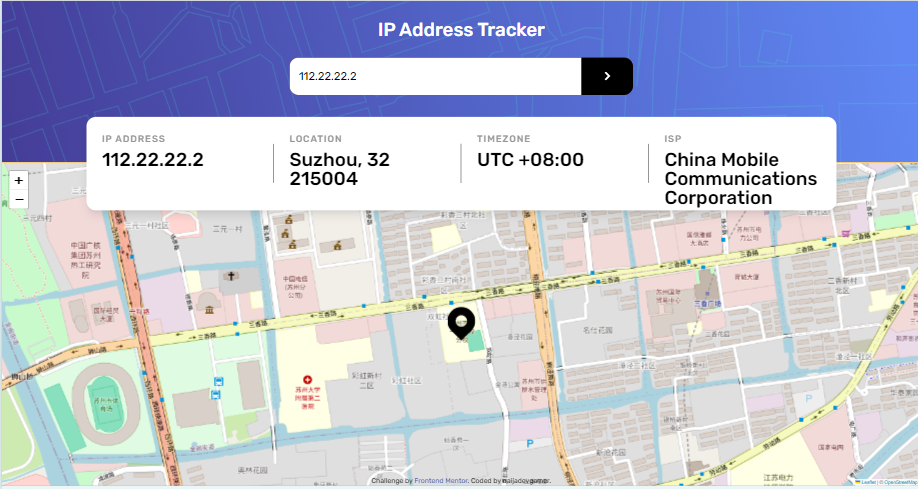

<h1 align="center">IP Address Tracker App 🗺️📍</h1>

<div align="center">
   Solution for a challenge from <a href="https://www.frontendmentor.io" target="_blank">Frontend Mentor</a>.
</div>

<div align="center">
  <h3>
    <a href="https://naijadevgamer.github.io/ip-address-tracker">
     Live Demo
    </a>
    <span> | </span>
    <a href="https://github.com/naijadevgamer/ip-address-tracker">
      Solution
    </a>
    <span> | </span>
    <a href="https://www.frontendmentor.io/challenges/ip-address-tracker-I8-0yYAH0">
      Challenge
    </a>
  </h3>
</div>

<!-- TABLE OF CONTENTS -->

## 📋 Table of Contents

- [Overview](#-overview)
  - [The Challenge](#the-challenge)
  - [Built With](#-built-with)
  - [What I Learned](#what-i-learned)
- [Features](#-features)
- [How To Use](#-how-to-use)
- [Author](#author)
- [Acknowledgements](#-acknowledgements)

---

<!-- OVERVIEW -->

## 🌍 Overview



Welcome to my IP Address Tracker App! This app allows you to discover key information about an IP address or domain, including its location on an interactive map. Whether you want to track an IP address for security purposes or just for curiosity, this app makes it easy and fun! 🌍📍

### The Challenge

Users should be able to:

- View the optimal layout for each page depending on their device's screen size
- See hover states for all interactive elements on the page
- See their own IP address on the map on the initial page load
- Search for any IP addresses or domains and see the key information and location

### 🛠️ Built With

This application was built using the following technologies:

- [TypeScript](https://www.typescriptlang.org/)
- [Tailwind CSS](https://tailwindcss.com/)
- [Leaflet](https://leafletjs.com/) - Interactive maps
- [IPWHOIS Geolocation API](https://ipwhois.io/) - IP tracking and location data
- [HTML](https://developer.mozilla.org/en-US/docs/Web/HTML)

### What I Learned

Building the IP Address Tracker app was an exciting experience. I learned a lot about integrating third-party APIs using TypeScript. The project also gave me the opportunity to work with Leaflet, which made creating dynamic maps straightforward and enjoyable. This project has definitely enhanced my skills in creating interactive web applications! 🚀

One of the most challenging aspects was parsing the data from the IP Geolocation API and ensuring the map displayed accurately based on the user's search input. It was a rewarding experience to see it all come together!

Throughout this project, I honed my skills in writing clean, maintainable code by adhering to the DRY (Don't Repeat Yourself) principle, and I also optimize the code for better performance.

### My Wisdom 🌟

Here's a piece of wisdom from my journey: _"Stay curious and always be willing to dive into the unknown."_ Trying new APIs and tools might seem daunting at first, but the learning process is incredibly rewarding.

---

## ✨ Features

Here's what the app can do:

- **Default IP Address Tracking**: On the initial page load, see your own IP address and location on the map.
- **IP Address/Domain Search**: Search for any IP address or domain and get key information such as location, ISP, and timezone.
- **Interactive Map**: View the location of the searched IP address/domain on an interactive map.
- **Responsive Design**: Enjoy a seamless experience across all devices, from desktop to mobile.
- **Hover States**: Experience smooth transitions and hover states on interactive elements.

---

## 🚀 How To Use

To clone and run this application, you'll need [Git](https://git-scm.com) and [Node.js](https://nodejs.org/en/download/) (which comes with [npm](http://npmjs.com)) installed on your computer. From your command line:

```bash
# Clone this repository
$ git clone https://github.com/naijadevgamer/ip-address-tracker

# Navigate into the directory
$ cd ip-address-tracker

# Install dependencies
$ npm install

# Run the app
$ npm start
```

---

## Author

[Saleeman Abdullahi Alaba Aransiola]

Feel free to reach out if you have any questions or suggestions. I’d love to hear from you! 😊

- **GitHub**: [My GitHub Profile](https://github.com/naijadevgamer)
- **Twitter**: [@naijadevgamer](https://www.twitter.com/naijadevgamer)
- **Instagram**: [@naijadevgamer](https://www.instagram.com/naijadevgamer)
- **LinkedIn**: [Abdullah Saleeman](https://www.linkedin.com/in/abdullah-saleeman-360170243)
- **Email**: [sabdullahialaba50@gmail.com](mailto:sabdullahialaba50@gmail.com)
- **Frontend Mentor**: - [@naijadevgamer](https://www.frontendmentor.io/profile/naijadevgamer)

---

## 🙏 Acknowledgments

I extend my gratitude to the Almighty ALLAH for guiding me through this project.

This project was possible thanks to some amazing resources and tools:

- **[Frontend Mentor](https://www.frontendmentor.io/)**: For providing the challenge that inspired me to build this application and offering a platform to showcase and refine my skills.
- **[Leaflet](https://leafletjs.com/)**: For providing a robust and easy-to-use library for embedding interactive maps, which was crucial for visualizing IP locations.
- **[IPWHOIS Geolocation API](https://ipwhois.io/)**: For offering accurate and reliable IP tracking and location data, which is the core functionality of this app.
